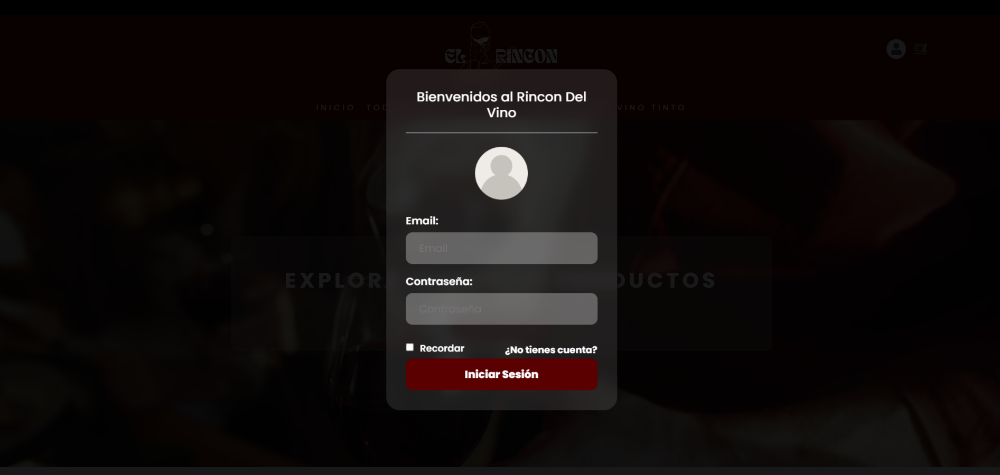
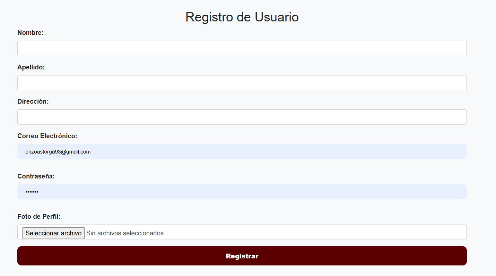
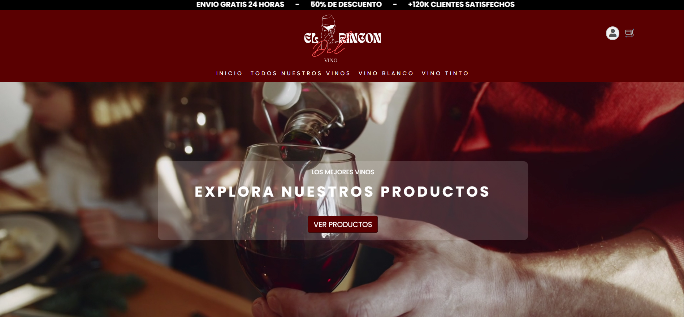
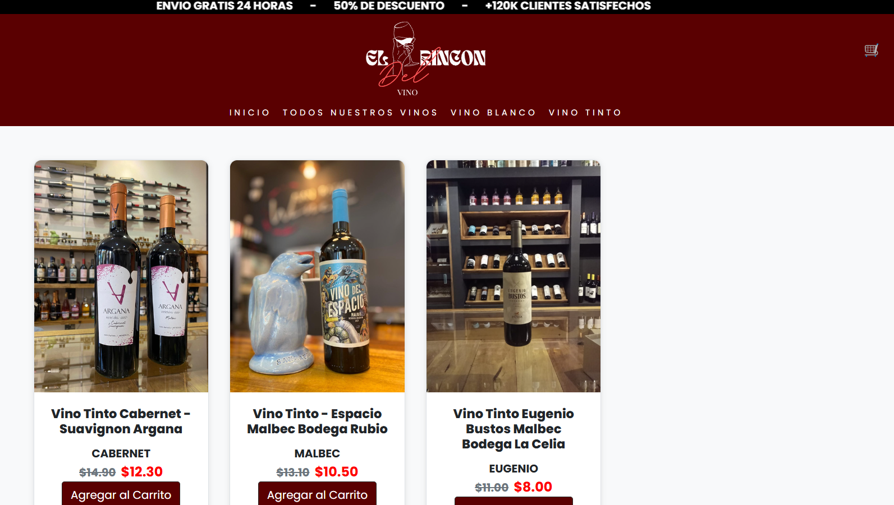
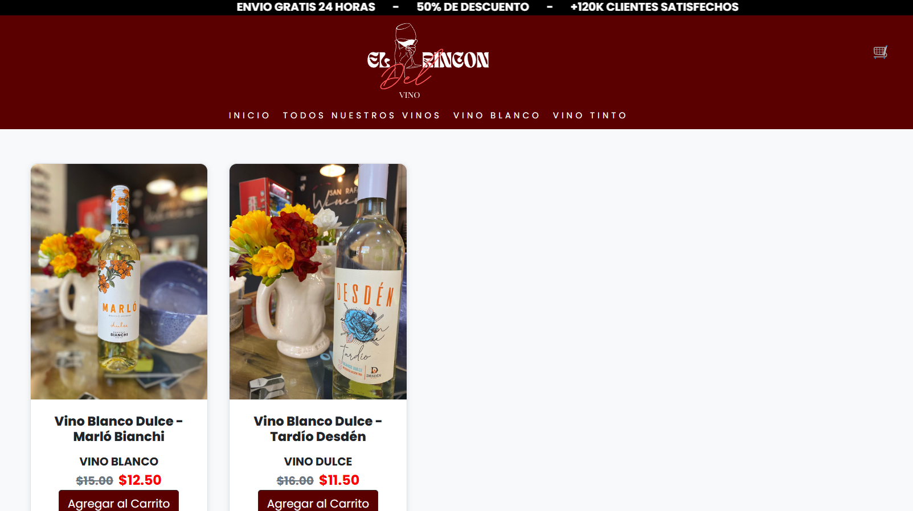
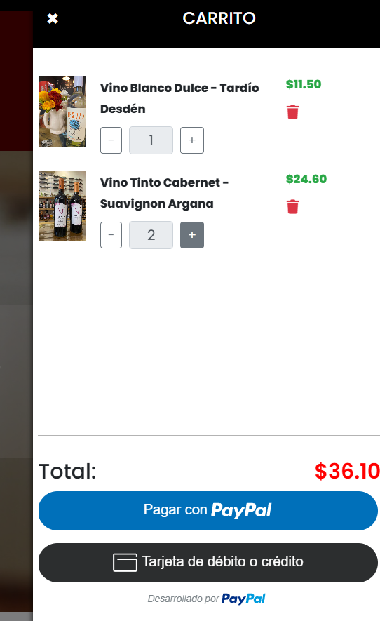
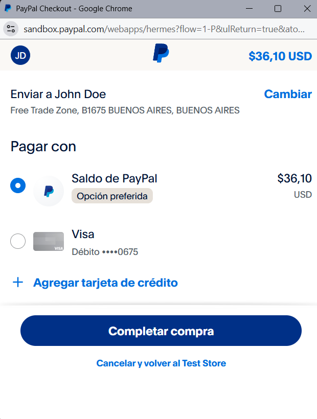

<div align="center">

  

</div>


E-commerce para la compra de vinos, diseñado para ofrecer una experiencia intuitiva a los usuarios. Este proyecto permite registrarse, navegar por diferentes productos, gestionar un carrito de compras y realizar pedidos de manera sencilla.

Realizado por el Equipo 404 NotFound como proyecto final para la Tecnicatura Universitaria en Programación de la UTN FRSR de San Rafael, Mendoza.

## Tecnologías Utilizadas 🧰

- **Frontend**:
-    

- **Backend**:
- 
  
- **Base de datos**:
- 
- **Control de versiones**:
-  

## Dependencias 🗂

Este proyecto utiliza las siguientes dependencias de Node.js:

- **@mailchimp/mailchimp_marketing**: ^3.0.80
- **bcrypt**: ^5.1.1
- **cors**: ^2.8.5
- **crypto**: ^1.0.1
- **dotenv**: ^16.4.5
- **express**: ^4.21.0
- **express-handlebars**: ^8.0.1
- **morgan**: ^1.10.0
- **multer**: ^1.4.5-lts.1
- **mysql**: ^2.18.1
- **mysql2**: ^3.11.3
- **nodemailer**: ^6.9.14
- **nodemon**: ^3.1.7
- **paypal-rest-sdk**: ^1.8.1

### DevDependencies

- **@types/nodemailer**: ^6.4.16

## Instalación y Configuración ⚙️

1. Clona el repositorio:

    ```
    git clone https://github.com/tu-usuario/el-rincon-del-vino.git
    cd el-rincon-del-vino
    ```

2. Instala las dependencias:

    ```
    npm install
    ```

3. Crea un archivo `.env` en la raíz del proyecto con las siguientes variables de entorno:

    ```
    DB_HOST=localhost
    DB_USER=tu_usuario
    DB_PASSWORD=tu_contraseña
    DB_NAME=nombre_de_tu_base_de_datos
    PORT=puerto_que_quieres_usar
    ```

4. Configura la base de datos MySQL ejecutando el script SQL proporcionado en la carpeta `sql`:

    ```
    mysql -u tu_usuario -p nombre_de_tu_base_de_datos < sql/sqlFinal.sql
    ```

5. Inicia la aplicación:

    - En modo producción:

        ```
        npm start
        ```

    - En modo desarrollo (con recarga automática):

        ```
        npm run dev
        ```

6. Para ejecutar el e-commerce, puedes usar la extensión Live Server desde `index.html`.

## Manual de Usuario 📚

- **Inicio de Sesión**: Inicia sesión en tu cuenta para realizar compras.
  
  

- **Registro**: Si no tienes cuenta debes registrarte.


  
- **Navega por nuestra web**: En el botón VER PRODUCTOS explora una variedad de vinos y consulta sus detalles.
  
  

- **Categorización**: Categorías de vino tinto y blanco.
  
  
  
  
  
- **Carrito**: Agrega productos al carrito, ajusta las cantidades y procede al pago.
  
  
  
- **Proceso de Pago**: Se incluye integración con PayPal para procesar las transacciones.
  
  


## Estructura del Proyecto 📊

**Frontend**:
- **client/**: Contiene los archivos del frontend.
  - **assets/**: Recursos estáticos como imágenes y estilos.
  - **js/**: Scripts de JavaScript para funcionalidades del frontend.
- **index.html**: Página principal del cliente.
- **perfil.html**: Página para gestionar el perfil del usuario.
- **producto.html**: Página para mostrar un producto específico.
- **productos.html**: Página para listar todos los productos.
- **registro.html**: Página para el registro de nuevos usuarios.
- **vino-blanco.html**: Página específica para vinos blancos.
- **vino-tinto.html**: Página específica para vinos tintos.

**Backend**:
- **controllers/**: Controladores de las rutas del backend.
- **routes/**: Definición de rutas para cada recurso.
- **index.js**: Archivo principal del backend.
- **config.js**: Configuraciones generales del backend.

**Base de datos**:
- **sql/**: Contiene el archivo SQL para la estructura de la base de datos.

**Configuración y Dependencias**:
- **.vscode/**: Configuraciones específicas del entorno de desarrollo.
  - **settings.json**: Configuración del editor Visual Studio Code.
- **uploads/**: Carpeta para el almacenamiento de archivos subidos por el usuario.
- **node_modules/**: Carpeta que aparece cuando se instalan las dependencias del proyecto.
- **package.json**: Archivo de configuración de npm que contiene dependencias y scripts del proyecto.
- **package-lock.json**: Archivo que asegura la instalación exacta de dependencias.
- **.env**: Archivo para variables de entorno.


## Equipo 404 NotFound 💻
<table> 
  <tr> 
    <th>Área</th> <th>Integrantes</th> 
  </tr> 
  <tr> 
    <td>Backend</td> 
    <td>Ignacio José Rocha<br>Débora Celeste Pulitta<br>Diego Rafael Ramos Llanos</td> 
  </tr> 
  <tr> 
    <td>Base de Datos</td> 
    <td>Matías Landi<br>Gonzalo Balmaceda<br>Javier Mariñanco</td> 
  </tr> 
  <tr> 
    <td>Frontend</td> <td>Sebastián Betancurth<br>Enzo Astorga<br>Maximiliano Robilotta</td> 
  </tr> 
</table>


